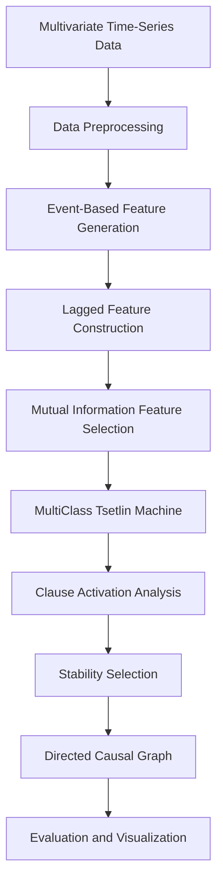

# Interpretable Temporal Causal Discovery using Tsetlin Machines

> An interpretable framework for temporal causal discovery that combines event-based feature engineering, Tsetlin Machines, clause activation analysis, and stability selection to recover causal relationships from multivariate time-series data.


---

## Overview

Temporal causal discovery aims to identify cause-and-effect relationships from multivariate time-series data. Existing statistical and deep learning approaches can model complex temporal dependencies but often provide limited interpretability.

This project proposes an interpretable temporal causal discovery framework based on **Tsetlin Machines**, which learn human-readable logical clauses rather than black-box representations. Continuous numerical signals are transformed into event-based features, temporal dependencies are modelled through lagged features, and robust causal relationships are identified using clause activation analysis and stability selection.

The framework was developed as part of my **MSc Computing (Artificial Intelligence and Machine Learning)** dissertation at **Imperial College London**.

The repository provides a fully reproducible implementation of the proposed framework, covering the complete pipeline from data preprocessing to causal graph generation and evaluation.

---

## Quick Start

Clone the repository:

```bash
git clone https://github.com/srishtimishra24/interpretable-temporal-causal-modelling.git
cd interpretable-temporal-causal-modelling
```

Create a virtual environment and install the dependencies:

```bash
python3 -m venv .venv
source .venv/bin/activate
pip install -r requirements.txt
```

Run the framework:

```bash
python src/main.py
```

---

## Features

- Interpretable temporal causal discovery using Tsetlin Machines
- Event-based representation of continuous multivariate time-series
- Automatic temporal lag generation
- Mutual Information feature selection
- Clause activation analysis
- Stability selection across multiple training runs
- Automatic causal graph construction
- Quantitative evaluation against established causal discovery methods

---

## Framework



The proposed framework consists of:

1. Data preprocessing
2. Event generation
3. Lagged feature construction
4. Mutual Information feature selection
5. MultiClass Tsetlin Machine training
6. Clause activation analysis
7. Stability selection
8. Directed causal graph generation
9. Evaluation and visualisation

---

## Repository Structure

```text
interpretable-temporal-causal-modelling/
│
├── src/                  Source code
├── data/                 Dataset instructions
├── docs/                 Documentation
├── images/               Generated causal graphs
├── notebooks/            Experimental notebooks
├── results/              Evaluation results
├── tests/                Unit tests
│
├── README.md
├── requirements.txt
└── LICENSE
```

---

## Installation

### Requirements

- Python 3.10+
- pip

Install the required packages:

```bash
pip install -r requirements.txt
```

---

## Dataset

The framework was evaluated on four publicly available IT monitoring datasets:

- Antivirus Activity
- Web Activity
- Middleware Oriented Message Activity
- Storm Ingestion Activity

The datasets are **not included** in this repository.

Please refer to **`data/README.md`** for instructions on obtaining and organising the datasets.

---

## Usage

Run the complete causal discovery pipeline:

```bash
python src/main.py
```

The framework automatically:

- Loads the selected dataset
- Generates event-based features
- Constructs lagged temporal features
- Performs Mutual Information feature selection
- Trains the Tsetlin Machine
- Performs clause activation analysis
- Applies stability selection
- Constructs the inferred causal graph
- Evaluates graph recovery performance
- Saves the generated graph and evaluation results

---

## Technologies

- Python
- NumPy
- Pandas
- Scikit-learn
- NetworkX
- Matplotlib
- pyTsetlinMachine

---

## Experimental Evaluation

The proposed framework was evaluated on four benchmark IT monitoring datasets and compared against multiple causal discovery methods.

### Compared Methods

- PCMCI
- CBNB-e
- NBCB-e
- GCMVL
- DYNOTEARS

### Evaluation Metrics

- Precision
- Recall
- F1 Score
- Adjacency F1
- Orientation F1
- Runtime

---

## Results

| Dataset | Precision | Recall | F1 Score |
|---------|----------:|-------:|---------:|
| Antivirus | 0.030 | 0.062 | 0.041 |
| Web Activity | 0.259 | 0.500 | 0.341 |
| Middleware | 0.300 | 0.600 | 0.400 |
| Storm | 0.167 | 0.333 | 0.222 |

Detailed evaluation metrics are available in the **results/** directory.

---

## Example Output

The figure below shows an example causal graph inferred by the proposed framework.

<p align="center">
  
</p>

---

## Research Contributions

The main contributions of this work are:

- An interpretable temporal causal discovery framework based on Tsetlin Machines.
- An event-based feature engineering pipeline for continuous multivariate time-series.
- A clause activation analysis strategy for identifying influential variables.
- A stability selection procedure for improving the robustness of inferred causal relationships.
- Comprehensive evaluation on synthetic and real-world IT monitoring datasets against established causal discovery baselines.

---

## Future Work

Potential directions for future research include:

- Comparison with additional causal discovery methods such as Neural Granger Causality and TCDF.
- Evaluation on larger benchmark datasets, including CausalRiver.
- Adaptive lag selection.
- Online temporal causal discovery for streaming data.
- Continuous-valued Tsetlin Machine variants.

---

## Citation

If you use this repository in your research, please cite:

```bibtex
@mastersthesis{mishra2026,
  author = {Srishti Mishra},
  title = {Interpretable Temporal Causal Discovery using Tsetlin Machines},
  school = {Imperial College London},
  year = {2026}
}
```

---

## Acknowledgements

This work was completed as part of the **MSc Computing (Artificial Intelligence and Machine Learning)** programme at **Imperial College London** under the supervision of **Dr. Ce Guo** and **Prof. Wayne Luk**.