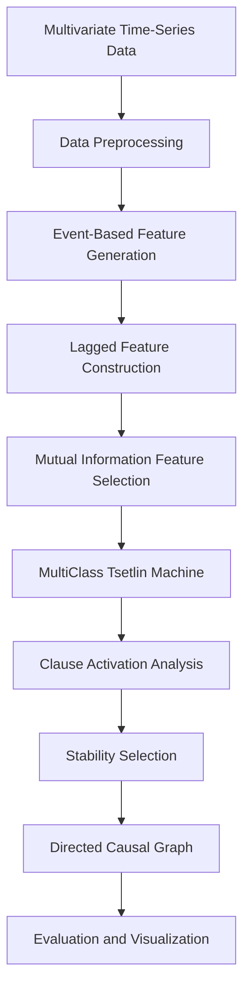
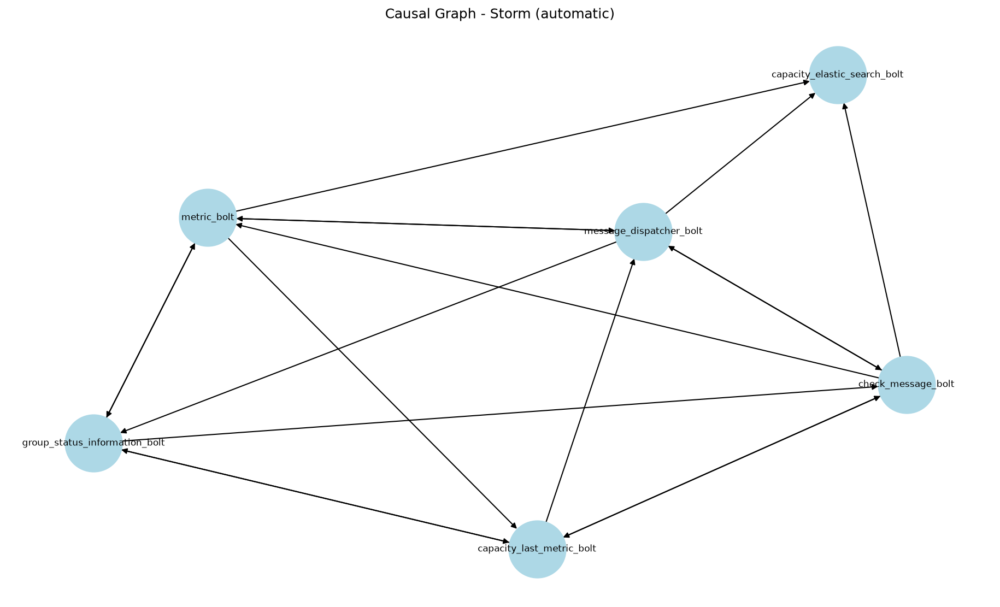

You're right. You want the **actual raw Markdown file**, with the Markdown syntax visible, not a rendered/annotated version.

Copy everything below directly into `README.md`:

````markdown
# Interpretable Temporal Causal Discovery using Tsetlin Machines

> An interpretable framework for temporal causal discovery that combines event-based feature engineering, Tsetlin Machines, clause activation analysis, and stability selection to recover causal relationships from multivariate time-series data.


---

## Overview

Temporal causal discovery aims to identify cause-and-effect relationships from multivariate time-series data. Existing statistical and deep learning approaches can model complex temporal dependencies but often provide limited interpretability.

This project proposes an interpretable temporal causal discovery framework based on **Tsetlin Machines**, which learn human-readable logical clauses rather than black-box representations. Continuous numerical signals are transformed into event-based features, temporal dependencies are modelled through lagged features, and robust causal relationships are identified using clause activation analysis and stability selection.

The framework was developed as part of my **MSc Computing (Artificial Intelligence and Machine Learning)** dissertation at **Imperial College London**.

The repository provides the implementation of the proposed framework, covering the complete pipeline from data preprocessing to causal graph generation and evaluation.

---

## Quick Start

Clone the repository:

```bash
git clone https://github.com/srishtimishra24/interpretable-temporal-causal-modelling.git

cd interpretable-temporal-causal-modelling
```

Create a virtual environment and install the dependencies:

```bash
python3 -m venv .venv

source .venv/bin/activate

pip install -r requirements.txt
```

Run the framework through the command-line interface:

```bash
python src/cli.py \
--input data/Web_Activity/combined.csv \
--output outputs/Web_Activity_final_TM.txt \
--ground-truth data/Web_Activity/structure.txt
```

---

## Features

- Interpretable temporal causal discovery using Tsetlin Machines
- Percentile-based event representation of continuous multivariate time-series
- Automatic temporal lag generation
- Mutual Information feature selection
- Clause activation analysis
- Stability selection across multiple training runs
- Automatic causal graph construction
- Command-line interface for fully automatic execution
- Quantitative evaluation against established causal discovery methods

---

## Framework



The proposed framework consists of:

1. Data preprocessing
2. Event generation
3. Lagged feature construction
4. Mutual Information feature selection
5. MultiClass Tsetlin Machine training
6. Clause activation analysis
7. Stability selection
8. Directed causal graph generation
9. Evaluation and visualisation

---

## Repository Structure

```text
interpretable-temporal-causal-modelling/

│
├── src/                  Source code
├── data/                 Dataset instructions
├── images/               Generated causal graphs
├── tests/                Unit tests
│
├── README.md
├── requirements.txt
└── LICENSE
```

The datasets themselves are not included in the repository.

---

## Installation

### Requirements

- Python 3.10+
- pip

Install the required packages:

```bash
pip install -r requirements.txt
```

---

## Dataset

The framework was evaluated on four publicly available IT monitoring datasets:

- Antivirus Activity
- Web Activity
- Middleware Oriented Message Activity
- Storm Ingestion Activity

The datasets are **not included** in this repository.

Please refer to **`data/README.md`** for instructions on obtaining and organising the datasets.

The final experiments used:

```text
data/Antivirus_Activity/combined.csv
data/Web_Activity/combined.csv
data/Middleware_oriented_message_Activity/combined.csv
data/Storm_Ingestion_Activity/storm_data_normal.csv
```

---

## Usage

The framework is executed through the command-line interface.

Example:

```bash
python src/cli.py \
--input data/Web_Activity/combined.csv \
--output outputs/Web_Activity_final_TM.txt \
--ground-truth data/Web_Activity/structure.txt \
--tau 3 \
--runs 10 \
--stability 0.7 \
--top-k 3 \
--clauses 500 \
--epochs 100
```

The framework automatically:

- Loads the selected dataset
- Processes all variables as potential target variables
- Generates event-based features
- Constructs lagged temporal features
- Performs Mutual Information feature selection
- Trains the Tsetlin Machine
- Performs clause activation analysis
- Applies stability selection
- Constructs the inferred causal graph
- Evaluates graph recovery performance when ground truth is provided
- Saves the generated graph and evaluation results

### Final Configuration

The final experiments used:

- Maximum temporal lag (`tau`): 3
- Stability runs: 10
- Stability threshold: 0.7
- Top-K candidates per run: 3
- Tsetlin Machine clauses: 500
- Training epochs: 100

---

## Technologies

- Python
- NumPy
- Pandas
- Scikit-learn
- NetworkX
- Matplotlib
- pyTsetlinMachine

---

## Experimental Evaluation

The proposed framework was evaluated on four real-world IT monitoring datasets and compared against multiple causal discovery methods.

### Compared Methods

- PCMCI
- CBNB-e
- NBCB-e
- GCMVL
- DYNOTEARS

### Evaluation Metrics

- Precision
- Recall
- F1 Score
- Adjacency F1
- Orientation F1
- Runtime

---

## Results

The final Tsetlin Machine configuration produced the following results:

| Dataset | Precision | Recall | Orientation F1 | Adjacency F1 | Runtime (s) |
|---------|----------:|-------:|---------------:|-------------:|------------:|
| Antivirus | 0.031 | 0.062 | 0.042 | 0.190 | 241.3 |
| Web Activity | 0.296 | 0.571 | 0.390 | 0.562 | 1677.6 |
| Middleware | 0.333 | 0.700 | 0.452 | 0.692 | 45.2 |
| Storm | 0.167 | 0.333 | 0.222 | 0.273 | 69.7 |

The strongest performance was obtained on the Middleware dataset, while performance was substantially weaker on Antivirus. The results indicate that the effectiveness of the proposed pipeline is dataset-dependent.

---

## Example Output

The figure below shows an example causal graph inferred by the proposed framework.

<p align="center">
  
</p>

---

## Research Contributions

The main contributions of this work are:

- An interpretable temporal causal discovery framework based on Tsetlin Machines.
- An event-based feature engineering pipeline for continuous multivariate time-series.
- Percentile-based event transformation to avoid fixed dataset-specific thresholds.
- Automatic temporal lag construction.
- Mutual Information feature selection for reducing the candidate feature space.
- A clause activation analysis strategy for identifying influential variables.
- A stability selection procedure for improving the robustness of inferred causal relationships.
- A command-line interface supporting fully automatic execution on CSV input.
- Evaluation on four real-world IT monitoring datasets against established causal discovery baselines.

---

## Limitations

The current framework has several limitations:

- Event-based transformation can remove information about the magnitude and fine-grained variation of continuous signals.
- Mutual Information feature selection, top-K candidate selection, and stability filtering can exclude relevant relationships before final graph construction.
- Repeated Tsetlin Machine training for stability selection increases computational cost.
- Performance is dataset-dependent, with substantially weaker results observed on Antivirus.

---

## Future Work

Potential directions for future research include:

- Bayesian hyperparameter optimisation
- Alternative event and binarisation methods
- Evaluation on additional datasets, including CausalRiver
- Comparison with Neural Granger Causality and TCDF
- Adaptive lag selection
- Runtime and parallelisation improvements
- Ablation studies of the event transformation and candidate-selection stages
- Evaluation on a wider range of temporal causal structures

---

## Citation

If you use this repository in your research, please cite:

```bibtex
@mastersthesis{mishra2026,
  author  = {Srishti Mishra},
  title   = {Interpretable Temporal Causal Discovery using Tsetlin Machines},
  school  = {Imperial College London},
  year    = {2026}
}
```

---

## Acknowledgements

This work was completed as part of the **MSc Computing (Artificial Intelligence and Machine Learning)** programme at **Imperial College London** under the supervision of **Dr. Ce Guo** and **Prof. Wayne Luk**.

---

## License

This project is released under the MIT License. See [`LICENSE`](LICENSE) for details.
````
